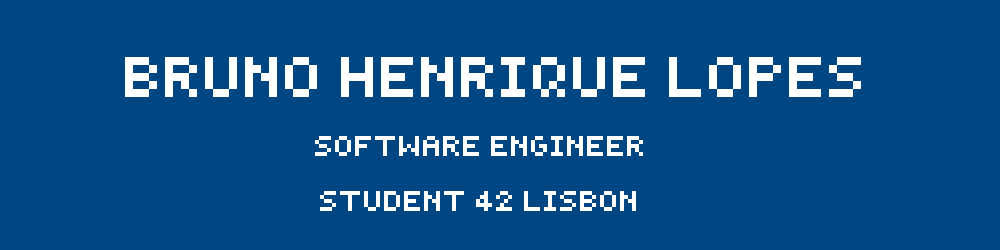

## Main Projects
**[MINISHELL](https://github.com/nyykooo/Minishell)**: Emblematic project. It's a customised shell with lots of features and details that mimic Bash. I developed this amazing project alongside my colleague Nyko!  
**[FDF](https://github.com/gitbrunoh/fdf)**: So cool! This project is about representing a landscape as a 3D object in which all surfaces are outlined in lines.  
**[PHILOSOPHERS](https://github.com/gitbrunoh/dining-philosophers-problem
)**: The famous dining-philosophers-problem!  
**[MINITALK](https://github.com/gitbrunoh/dining-philosophers-problem
)**: Communication between procecess using only UNIX signals! 👾  

## 	Technologies and tools I've been using

## Contact
📫 E-mail: [📬 brunohenriqueufpr@gmail.com](mailto:seu-email@example.com)

